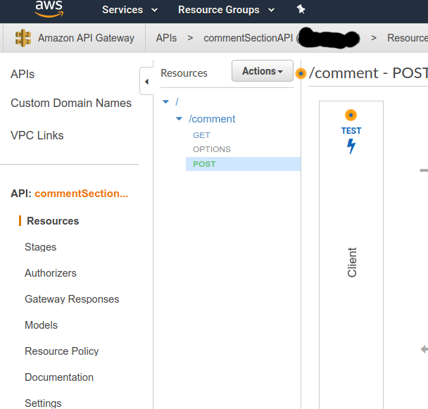

# AWS Comment Section

In this tutorial we will be creating a comment section for a website using AWS. The inspiration for this tutorial is the following: https://aws.amazon.com/blogs/compute/using-amazon-api-gateway-as-a-proxy-for-dynamodb/.

The comments will be stored in `DynamoDB` and `API Gateway` will be the interface between website user and `DynamoDB` for the purpose of saving and loading the comments. After posting the comment, the comment will await moderation by the site owner via email. The code and instructions will be provided to create the following html page here:


After verifying Google captcha and upon submitting a comment the comment (don't worry - newline support is now included) will be saved to a database and an email will be sent to the comment section's owner's email with the following body


Upon pressing the link a reply window will pop up. Upon pressing "send" on the pop up, the email will be sent to and processed by AWS API gateway. The API gateway code will make the comment be visible on the website upon refresh.

This tutorial aims to be easy to follow. This was done as part of familiarizing with AWS, so if reader has suggestions or improvements then open up an issue or pull request.

The order of the tutorial:

1. **Creating the Dynamodb** - database where all the comments will be saved to and retrieved from
2. **Create Lambda function** - Creating the lambda function which will save comments and retrieve them from the database to the website.
3. **Connecting Lambda to DynamoDB through roles** - Giving permission to Lambda function to read/write the database
4. **API gateway** - Creating a way for the outside world to retrieve and save to  database using the lambda function.
5. **Testing interlude** - Testing the lambda function is able to save to the database without making API public.
6. **Deploying API** - Making the API public.
7. **Testing interlude 2** - Write and read from the database from your own terminal
8. **Html code** - Basic page that now allows you to submit and see comments in your browser
9. **Adding email notifications** - Email alerts in order to know when a comment has been entered. The comment awaits moderation before publicly appearing. Moderation involves modifying the database manually. 
10. **Bonus content** - Adding a Google captcha for additional protection. In addition, created way to approve comment in email application without having to manually edit database.


# Creating the DynamoDB

The first step will be to create a `DynamoDB` table. This table will store the comments for the purposes of retrieving by user using a `GET` command and to store comments using a `POST` command.

First let's create the table


We will call the table `CommentSection` and the key will be `commentID`. Each comment will have a `commentID` key and the key will be used to keep the comments distinct. 


For the table, let's create an index. Indexes are used for querying the database efficiently and will be used in our case to get comments for a given `pageID`. Each comment will have a `pageID` which will represent all comments on a specific page. This is useful when you have multiple pages and need to retrieve comments for a specific page.


Pressing "Create Index" will create a pop-up. Fill it out as follows and press "Create Index":


The additional include values can be customized to match the situation. For example it might be desirable to also include an email field. `approved` will be used to store whether the comment has been approved or not by website owner and `display_name` will be the self selected user name by the website user. Now let's modify the capacity:


This should match your requirements and traffic expectations. The following is expectation for a small website.


# Create the Lambda

Let's create the lambda function. This function will be the middle man between the DynamoDB and the client. It will respond to `GET` and `POST` requests.

Press "Create Function"


We will be using Python 3.8 here.


The following code will be used

```python
import json
import datetime
import re
import sys
import boto3
from botocore.vendored import requests
import logging
import urllib3
from urllib.parse import unquote
from urllib.parse import quote
from boto3.dynamodb.conditions import Key, Attr

def POST(event, context):
    try:
        parameters = event["queryStringParameters"]
                
        display_name = unquote(parameters['display_name'])
        checkLength("Display name",unquote(display_name),100)
        
        comment = parameters['comment']
        checkLength("Comment",unquote(comment),1000)
        
        page_id = unquote(parameters['page_id'])
        checkLength("Page id", page_id, 200)
    
        client = boto3.resource('dynamodb')
        table = client.Table("CommentSection")
        ID = event['requestContext']['requestId'] + ""
        time_stamp = datetime.datetime.utcnow().strftime('%Y-%m-%d %H:%M:%S.%f')
        table.put_item(Item={'commentID':ID,'pageID':page_id,'display_name':display_name,'approved':'False','comment':comment,'time_stamp':time_stamp})
            
        return {
            'statusCode': 200,
            'headers': {
                'X-Requested-With': '*',
                'Access-Control-Allow-Headers': 'Content-Type,X-Amz-Date,Authorization,X-Api-Key,x-requested-with,access-control-allow-origin',
                'Access-Control-Allow-Origin': '*',
                'Access-Control-Allow-Credentials' : 'true',
                'Access-Control-Allow-Methods': 'POST,GET,OPTIONS'
            },
            'body': json.dumps("Comment awaiting moderation")
        }
    except  Exception as e:
        return {
            'statusCode': 404,
            'body': e.message
        }
    
def GET(event, context):
    try:
        parameters = event["queryStringParameters"]
        page_id = parameters['page_id']
        checkLength('Page id', page_id, 200)
        
        client = boto3.resource('dynamodb')
        table = client.Table('CommentSection')
        response = table.query(
            IndexName='pageID-index',
            KeyConditionExpression=Key('pageID').eq(page_id))
        comments = response['Items']    
            
        results = []
        for i in range(0,len(comments)):
            if comments[i]['approved']=='True':
                comment={'comment':quote(comments[i]['comment']),'display_name':quote(comments[i]['display_name']),'time_stamp':(comments[i]['time_stamp'])}
                results.append(comment)
        return {
            'statusCode': 200,
            'headers': {
                'X-Requested-With': '*',
                'Access-Control-Allow-Headers': 'Content-Type,X-Amz-Date,Authorization,X-Api-Key,x-requested-with,access-control-allow-origin',
                'Access-Control-Allow-Origin': '*',
                'Access-Control-Allow-Credentials' : 'true',
                'Access-Control-Allow-Methods': 'POST,GET,OPTIONS'
            },
            'body': json.dumps(results)
        }
    except  Exception as e:
        return {
            'statusCode': 404,
            'body': json.dumps(e.message)
        }
    
def lambda_handler(event, context):
    try:
        if event["httpMethod"] == "POST":
            return POST(event, context)
        elif event["httpMethod"] == "GET":
            return GET(event, context)
        elif event["httpMethod"] == "OPTIONS":
            return {
                'statusCode': 200,
                'headers': {
                    'X-Requested-With': '*',
                    'Access-Control-Allow-Headers': 'Content-Type,X-Amz-Date,Authorization,X-Api-Key,x-requested-with,access-control-allow-origin',
                    'Access-Control-Allow-Origin': '*',
                    'Access-Control-Allow-Credentials' : 'true',
                    'Access-Control-Allow-Methods': 'POST,GET,OPTIONS'
                }
            }
        else:
            raise Exception("Invalid request.")
    except  Exception as e:
        return {
            'statusCode':404,
            'body': json.dumps("Invalid request")
        }

def checkLength(name, str, maxLength):
    if len(str) > maxLength:
        raise Exception(name + " is too long.")
    if len(str) == 0:
        raise Exception(name + " is too short.")
```

There are **three** core components of the code.

The **first** is `def lambda_handler(event, context):` which is included right away upon loading the code for the lambda function for the first time. This is the code entry point. In the entry point we process request type and then run the relevant logic. There are three methods we are allowing: `GET`, `POST` and `OPTIONS`.

The **second** is the `GET` request. The `GET` function retrieves the `page_id` which is provided by the client request. A basic error check is conducted on length:
```python
parameters = event["queryStringParameters"]
page_id = parameters['page_id']
checkLength('Page id', page_id, 200)
```

We then connect to the previously created DynamoDB database using the `page_id` as index key and find all related comments in the database.

```python
client = boto3.resource('dynamodb')
table = client.Table('Comment')
response = table.query(
   IndexName='pageID-index',
   KeyConditionExpression=Key('pageID').eq(page_id))
comments = response['Items']
```

We then load up the response. Here we could perhaps sort the comments by date (in this case we will do this on the client side).

```python
results = []
for i in range(0,len(comments)):
    if comments[i]['approved']=='True':
        comment={'comment':quote(comments[i]['comment']),'display_name':quote(comments[i]['userName']),'time_stamp':quote(comments[i]['time_stamp'])}
        results.append(comment)
return {
    'statusCode': 200,
    'headers': {
        'X-Requested-With': '*',
        'Access-Control-Allow-Headers': 'Content-Type,X-Amz-Date,Authorization,X-Api-Key,x-requested-with,access-control-allow-origin',
        'Access-Control-Allow-Origin': '*',
        'Access-Control-Allow-Credentials' : 'true',
        'Access-Control-Allow-Methods': 'POST,GET,OPTIONS'
    },
    'body': json.dumps(results)
}
```

The **third** and final core component is the `POST` request. In the `POST` we first extract the parameters provided by client and do some basic error checking. The unquote function is related to how data is transmitted from client to the lambda function (`%20` translate to space...) 

```python
parameters = event["queryStringParameters"]
        
display_name = unquote(parameters['display_name'])
checkLength("Display name",display_name,100)

comment = unquote(parameters['comment'])
checkLength("Comment",comment,1000)

page_id = unquote(parameters['page_id'])
checkLength("Page id", page_id, 200)
```

After error checking the comment. We set the `approved` status to `False` as it has to await our moderation, we record the time of comment in order to keep track of order, the comment itself and the selected user name. The `unquote` and `quote` methods are used for translating transmition between client and server (such as `%20` to a space).

```python
 client = boto3.resource('dynamodb')
table = client.Table("CommentSection")
ID = event['requestContext']['requestId'] + ""
time_stamp = datetime.datetime.utcnow().strftime('%Y-%m-%d %H:%M:%S.%f')
table.put_item(Item={'commentID':ID,'pageID':page_id,'display_name':display_name,'approved':'False','comment':comment,'time_stamp':time_stamp})
```
stores the data to DynamoDB. `commentID`, the table's primary key as set in the very beginning of the dynamodb table is set to `event['requestContext']['requestId']` as based on [this](https://towardsdatascience.com/diving-deeper-into-aws-lambda-a52b22866767) my understanding is that this is unique.

You may be wondering what are the following for?
```python
'headers': {
	'X-Requested-With': '*',
	'Access-Control-Allow-Headers': 'Content-Type,X-Amz-Date,Authorization,X-Api-Key,x-requested-with,access-control-allow-origin',
	'Access-Control-Allow-Origin': '*',
	'Access-Control-Allow-Credentials' : 'true',
	'Access-Control-Allow-Methods': 'POST,GET,OPTIONS'
},
```
The core component is `Access-Control-Allow-Headers` which checks the origin of your request. When testing on localhost, `*` should suffice. However, when you upload the html to website `https://YOUROWNEDDOMAIN.COM` then you should change to
```python
'headers': {
	'X-Requested-With': 'https://YOUROWNEDDOMAIN.COM',
	'Access-Control-Allow-Headers': 'Content-Type,X-Amz-Date,Authorization,X-Api-Key,x-requested-with,access-control-allow-origin',
	'Access-Control-Allow-Origin': 'https://YOUROWNEDDOMAIN.COM',
	'Access-Control-Allow-Credentials' : 'true',
	'Access-Control-Allow-Methods': 'POST,GET,OPTIONS'
},
```


(don't forget to press the orange Save button above and to the right of the code editor after adding or udpating code in for AWS Lambda)

# Connecting Lambda to DynamoDB through roles

Here we will connect the previous two sections in AWS settings as they currently are completely separate. In order to access read and write to your dynamodb table from the lambda first navigate to your lambda section and scroll up to the top of the page and press the permissions tab.


Press the Role name "commentSectionManager-role-jk9..." entry.


You will be navigated to this following page where you will press "Attach policies"


Filter by policy for "AWSLambdaBasicExecutionRole", select and then press "Attach policy". You will be navigated back to the previous image where you will now press "Add inline policy":


You will add two resources. One for the index and one for the table itself. The table name from above is `CommentSection` and the index name is  `pageID-index`. The region name can also be found in the `dynamodb` home page under the overview tab of `CommentSection` table at the end of the page. Your account will be autofilled. After adding the index and table the page will look like the following:


The next page will give let you name your policy. Name it `commentSectionManager` and press "Create Policy"


We now have created some code and we should test it. However, there is one more step remaining: API gateway.

# API gateway

Navigate to API gateway and press orange "Create API" at the top right of the page.


You will select the "REST API" option


Select the following:


You will now face the following window:


Press "Actions" and "Create Resource"


And enter the following. We will enable CORS. Press "Create Resource" in bottom right.


You will be navigate to the previous page. While selecting  `comment`, press "Actions" and "Create Method". Choose GET. Fill out the following settings and press "Save":


Do the same for POST method as well. Now we are ready for some basic tests.

# Testing interlude

Testing work done is a good break and encouragement that we are on the right track. On the API gateway page from previous section select the GET.


Press the Test with lightning bolt and you will be navigated to


For "Query Strings" enter `page_id=page1` and press the lightining Test button at the bottom right. The Response Body will be `"[]"`. This makes sense as we have no comments. Let us add some comments. 

Navigate to the POST section and once again press the lightining Test.



Enter `page_id=page1&display_name=Stan&comment=I%20like%20this%20project.` to the Query Strings section and press the Test button at the bottom right.


The Response Body will be "Comment awaiting moderation". To see this comment navigate to Dynamodb "CommentSection" table and specifically the "Items" page. Here you will see the comment we just entered:


Let's go back to testing our GET method and enter `page_id=page1` for "Query Strings". We will still get `"[]"` for Reponse Body since we have not approved the comment. We will do this manually. Go to the row in the table and hover around `False` to be prompted to edit the entry. Set it to `True`. Now if you test GET, for "Reponse Body" you will get
```
[
  {
    "comment": "I like this project.",
    "display_name": "Stan",
    "time_stamp": "2020-05-20 02:27:14.571902"
  }
]
```
You can test this for multiple comments. Tada! 


# Deploying API 

Select comment and then "Deploy API"


The pop will appear. Fill it out as follows and press "Deploy":


You are now in the Stages section:


I set the following settings. Press "Save Changes"


Now press "Create Web ACL" and once again "Create web ACL". Fill out window as follows:


and at the bottom of the page press "Add AWS resource" fill aut as follows and press "Add".


Press "Next" and press "Add rules" > "Add managed rule groups"


Choose "AWS managed rule groups"


and select "Amazon IP reputation list" and "Core rule set". Press "Add rules" at the end of the page and then "Next".


For "Set rule priority" the order does not matter much in my opinion. I chose as follows:


After pressing "Next". I chose to select metrics:


Pressing "Next" you are presented with "Review and create web ACL". Scroll down and press "Create web ACL". Now navagating to the API gateway page you will select "commentSectionACL" for "Web ACL" and press "Save Changes"


Take note of the URL at the top beside "Invoke URL" as we will be using it in the next testing interlude".

Everytime you edit the code for lambda make sure to press the orange save button and then redeploy in the api gateway page.

# Testing interlude 2

We now have deployed our app. Let's test in our terminal. For this I was on my linux machine:

```
$ curl https://RANDOM_STRING_AS_SEEN_ON_APIGATEWAY.execute-api.us-west-2.amazonaws.com/prod/comment?page_id=page1
[{"comment": "I like this project.", "display_name": "Stan", "time_stamp": "2020-05-20 02:27:14.571902"}]
$ curl -X POST "https://RANDOM_STRING_AS_SEEN_ON_APIGATEWAY.execute-api.us-west-2.amazonaws.com/prod/comment?page_id=page1&display_name=Bob&comment=Hello"
"Comment awaiting moderation"
$ curl https://RANDOM_STRING_AS_SEEN_ON_APIGATEWAY.execute-api.us-west-2.amazonaws.com/prod/comment?page_id=page1
[{"comment": "I like this project.", "display_name": "Stan", "time_stamp": "2020-05-20 02:27:14.571902"}]
```

For manual moderation go DynamoDB CommentSection table and changed approved status to "True" for new comment. Now running the GET command we get the newly added command:
```
$ curl https://RANDOM_STRING_AS_SEEN_ON_APIGATEWAY.execute-api.us-west-2.amazonaws.com/prod/comment?page_id=page1
[{"comment": "I like this project.", "display_name": "Stan", "time_stamp": "2020-05-20 02:27:14.571902"}, {"comment": "Hello", "display_name": "Bob", "time_stamp": "2020-05-21 03:30:19.995843"}]

```

Things are working outside of AWS!


# Html code


Now let's see the html code:

```
<html>
	<head>
		<script src="https://ajax.googleapis.com/ajax/libs/jquery/3.4.1/jquery.min.js"></script>
	</head>
	
	<body>  
		<div style="width:50%;text-align:left;margin:0 auto;" id="container">
			<script>
				var objects = $.ajax({
					type: "GET",
					url: 'https://RANDOM_STRING_AS_SEEN_ON_APIGATEWAY.execute-api.us-west-2.amazonaws.com/prod/comment?page_id=page1',
					contentType: "application/json",
					dataType:'json',
					complete: function(data) {
						data = data.responseJSON
						data = data.sort( (a,b) => (new Date((a.time_stamp).substring(0,19).replace(' ','T')+"Z")) - (new Date((b.time_stamp).substring(0,19).replace(' ','T')+"Z")) )
						var container = document.getElementById('container');
						var my_html = '';
						for(var i = 0; i < data.length; i++){  
							my_html += '<hr style="width:100%;text-align:left;margin-left:0">';
							my_html += '<b>Name:</b> ' + data[i].display_name + '<br style="line-height:150%;"></br>';
							my_html += '<b>Time:</b> ' + (new Date((data[i].time_stamp).substring(0,19).replace(' ','T')+"Z")).toLocaleString()  + '<br style="line-height:150%;"></br>';
							my_html += '<b>Comment:</b><br style="line-height:150%;"></br>'+  data[i].comment + '<br style="line-height:150%;"></br>'
						}
						my_html += '<hr style="width:100%;text-align:left;margin-left:0">';
						container.innerHTML = my_html;
					}
				});
			</script>
		</div>
		<br>
		<div style="width:50%;text-align:left;margin:0 auto;">
			
			<div class="info">
				<label for="example">Display Name:</label>
				<input id="display_name" type="text" name="Ntext" style="background:transparent;border: 1px solid #000000;" size="20">
				<span style="color:red" id='message'></span>
			</div>

			<textarea rows="4" cols="50" style="border:1px solid #000000; width:100%; margin:5px 0;padding:3px;" id="comment">Enter comment here...</textarea>
			<br>
			<span id='remainingC'></span>
			<br>
			<button onclick="submit()" id="post-btn">Submit</button>
		</div>


<script>
	var maxLength = 500;

	$('textarea').keyup(function(){
	    if(this.value.length > maxLength){
		return false;
	    }
	    $("#remainingC").html("Remaining characters : " + (maxLength - this.value.length));
	});
	
	function validateEmail(email) {
		var re = /^(([^<>()[\]\\.,;:\s@\"]+(\.[^<>()[\]\\.,;:\s@\"]+)*)|(\".+\"))@((\[[0-9]{1,3}\.[0-9]{1,3}\.[0-9]{1,3}\.[0-9]{1,3}\])|(([a-zA-Z\-0-9]+\.)+[a-zA-Z]{2,}))$/;
		return re.test(email);
	}
	
	function submit(){

		$("#message").html("");

		var display_name = document.getElementById("display_name").value
		if(display_name.length > 100 || display_name.length < 1){
			$("#message").html("ERRROR: Display name must be between 1 and 100 characters.");
			return;
		}

		var comment = document.getElementById("comment").value
		if(comment.length > maxLength){
			$("#message").html("ERROR: Too much text in comment.");
			return;
		}
		if(comment.length < 1){
			$("#message").html("ERROR: No comment entered.");
			return;
		}	

		$.ajax({
			type: "POST",
			url: 'https://RANDOM_STRING_AS_SEEN_ON_APIGATEWAY.execute-api.us-west-2.amazonaws.com/prod/comment?display_name='+display_name+'&comment='+encodeURIComponent(comment)+'&page_id=page1',
			contentType: "application/json"
		});
		$("#message").html("Comment awaiting moderation.");
		document.getElementById("comment").value = 'Enter comment here...';
		document.getElementById("display_name").value = '';
		return;
	}
</script>
     </body>

</html>
```

There are two sections to the code. The submit section which upon pressing the submit botton.

Opening up the html file in a local browser and we can see the following:


After approving the comment in the Dynamodb database and refreshing the page:


# Adding email notifications

Everytime someone comments we want to be alerted via email.

We will start with verifying a new email address. Set your personal email address.


To your `commentSectionManager` lambda function we will add the following lines in the `POST` method:

```
	email_client = boto3.client('ses')
        
        response = email_client.send_email(
            Source='YOURPERSON@EMAILADDRESS.COM',
            Destination={
                'ToAddresses': [
                    'YOURPERSON@EMAILADDRESS.COM',
                ]
            },
            Message={
                'Subject': {
                    'Data': 'New Comment',
                    'Charset': 'UTF-8'
                },
                'Body': {
                    'Text': {
                        'Data': 'commentID:' + ID + '\nPageID:'+page_id+'\nDisplayName:'+display_name+'\nComment:'+comment,
                        'Charset': 'UTF-8'
                    }
                }
            }
        )
```
to get 
```
import json
import datetime
import re
import sys
import boto3 
import logging
from urllib.parse import unquote
from boto3.dynamodb.conditions import Key, Attr

def POST(event, context):
    try:
        parameters = event["queryStringParameters"]
        
        display_name = unquote(parameters['display_name'])
        checkLength("Display name",display_name,100)
        
        comment = unquote(parameters['comment'])
        checkLength("Comment",comment,1000)
        
        page_id = unquote(parameters['page_id'])
        checkLength("Page id", page_id, 200)
    
        client = boto3.resource('dynamodb')
        table = client.Table("CommentSection")
        ID = event['requestContext']['requestId'] + ""
        time_stamp = datetime.datetime.utcnow().strftime('%Y-%m-%d %H:%M:%S.%f')
        table.put_item(Item={'commentID':ID,'pageID':page_id,'display_name':display_name,'approved':'False','comment':comment,'time_stamp':time_stamp})
        
        email_client = boto3.client('ses')
        
        response = email_client.send_email(
            Source='YOURPERSON@EMAILADDRESS.COM',
            Destination={
                'ToAddresses': [
                    'YOURPERSON@EMAILADDRESS.COM',
                ]
            },
            Message={
                'Subject': {
                    'Data': 'New Comment',
                    'Charset': 'UTF-8'
                },
                'Body': {
                    'Text': {
                        'Data': 'commentID:' + ID + '\nPageID:'+page_id+'\nDisplayName:'+display_name+'\nComment:'+comment,
                        'Charset': 'UTF-8'
                    }
                }
            }
        )

        return {
            'statusCode': 200,
            'headers': {
                'X-Requested-With': '*',
                'Access-Control-Allow-Headers': 'Content-Type,X-Amz-Date,Authorization,X-Api-Key,x-requested-with,access-control-allow-origin',
                'Access-Control-Allow-Origin': '*',
                'Access-Control-Allow-Credentials' : 'true',
                'Access-Control-Allow-Methods': 'POST,GET,OPTIONS'
            },
            'body': json.dumps("Comment awaiting moderation")
        }
    except  Exception as e:
        return {
            'statusCode': 404,
            'body': e.message
        }
    
def GET(event, context):
    try:
        parameters = event["queryStringParameters"]
        page_id = parameters['page_id']
        checkLength('Page id', page_id, 200)
        
        client = boto3.resource('dynamodb')
        table = client.Table('CommentSection')
        response = table.query(
            IndexName='pageID-index',
            KeyConditionExpression=Key('pageID').eq(page_id))
        comments = response['Items']    
            
        results = []
        for i in range(0,len(comments)):
            if comments[i]['approved']=='True':
                comment={'comment':(comments[i]['comment']),'display_name':(comments[i]['display_name']),'time_stamp':(comments[i]['time_stamp'])}
                results.append(comment)
        return {
            'statusCode': 200,
            'headers': {
                'X-Requested-With': '*',
                'Access-Control-Allow-Headers': 'Content-Type,X-Amz-Date,Authorization,X-Api-Key,x-requested-with,access-control-allow-origin',
                'Access-Control-Allow-Origin': '*',
                'Access-Control-Allow-Credentials' : 'true',
                'Access-Control-Allow-Methods': 'POST,GET,OPTIONS'
            },
            'body': json.dumps(results)
        }
    except  Exception as e:
        return {
            'statusCode': 404,
            'body': json.dumps(e.message)
        }
    
def lambda_handler(event, context):
    try:
        if event["httpMethod"] == "POST":
            return POST(event, context)
        elif event["httpMethod"] == "GET":
            return GET(event, context)
        elif event["httpMethod"] == "OPTIONS":
            return {
                'statusCode': 200,
                'headers': {
                    'X-Requested-With': '*',
                    'Access-Control-Allow-Headers': 'Content-Type,X-Amz-Date,Authorization,X-Api-Key,x-requested-with,access-control-allow-origin',
                    'Access-Control-Allow-Origin': '*',
                    'Access-Control-Allow-Credentials' : 'true',
                    'Access-Control-Allow-Methods': 'POST,GET,OPTIONS'
                }
            }
        else:
            raise Exception("Invalid request.")
    except  Exception as e:
        return {
            'statusCode':404,
            'body': json.dumps("Invalid request")
        }

def checkLength(name, str, maxLength):
    if len(str) > maxLength:
        raise Exception(name + " is too long.")
    if len(str) == 0:
        raise Exception(name + " is too short.")
```

As done previously, add a new permission to `commentSectionManager` lambda.


Add an `AmazonSESFullAccess` policy:


After redeploying in API gateway, you can test it via terminal command or via the html file. You can open up the html in a local browser and test it. Upon submitting a comment you get an email. After approving it in the Dynamodb database and refreshing the html page you will then see the comment.


# Attaching to a domain name

Now that you have an html page, you can already place your html to wherever you host your website. You can even write a script that inserts a comment section to every page and modifies the html so that each comment section has its own unique `page_id`. However, we want to add a few more feautures to our comment section first. This will be bonus content so I will be a bit more straight to the point here assuming that the previous sections have got you warmed up.


We will attach a domain to our AWS account - which means you need to own one (`YOUROWNEDDOMAIN.COM`). Attaching domain will done at the AWS SES page (in tandem with your hosting website):


You will have the following setting:


Now we will create a "Rule Set" located towards the bottom of the page:


The rule will like the following:


The previous image requires for you to already have an `approveComment` lambda. The function is as follows:

```
import json
import datetime
import re
import sys
import boto3 
import logging
import urllib3
from urllib.parse import unquote
from urllib.parse import quote
from boto3.dynamodb.conditions import Key, Attr

def lambda_handler(event, context):

    sender = event['Records'][0]['ses']['mail']['source']

    if (str(sender) != "YOURPERSON@EMAILADDRESS.COM"):
        return {
            'statusCode': 404,
            'body': json.dumps('Wrong email')
        }
        

    subject = ''
    for section in event['Records'][0]['ses']['mail']['headers']:
        if section['name'] == 'Subject':
            subject = section['value']
            
    subject = json.loads(subject)
    
    client = boto3.resource('dynamodb')
    table = client.Table("CommentSection")

    table.update_item(
        Key={
            'commentID':subject['commentID']
        },
        UpdateExpression='SET approved = :value',  
        ExpressionAttributeValues={
            ':value': 'True'
        }
    )
    
    return {
        'statusCode': 200,
        'body': json.dumps('Hello from Lambda!')
    }

```

It needs the same permission as the previous lambda -> sending emails as well as acessing the dynamodb (`update_item`). However, it does not need to be deployed as it is not facing the public direct. In addition, we modify the email code within the `POST` function of `commentSectionManager` to send a more complicated email:
```
	response = email_client.send_email(
            Source='comments@YOUROWNEDDOMAIN.COM',
            Destination={
                'ToAddresses': [
                    'YOURPERSON@EMAILADDRESS.COM',
                ]
            },
            Message={
                'Subject': {
                        'Data': 'New comment!',
                    'Charset': 'UTF-8'
                },
                'Body': {
                    'Html': {
                        'Data': '<html><b>PageID</b>:'+page_id+',<br><b>DisplayName</b>:'+ display_name+',<br><b>Comment</b>:<br>' +unquote(parameters['comment']).replace('\n','<br>')+'<br>    <a href="mailto:comments@YOUROWNEDDOMAIN.COM?subject='+quote('{"commentID":"' +ID + '"}')+'">Click here to approve!</a></html>',
                        'Charset': 'UTF-8'
                    }
                }
            }
        )
```

to make: 

```
import json
import datetime
import re
import sys
import boto3
from botocore.vendored import requests
import logging
import urllib3
from urllib.parse import unquote
from urllib.parse import quote
from boto3.dynamodb.conditions import Key, Attr

def POST(event, context):
    try:
        parameters = event["queryStringParameters"]
             
        display_name = unquote(parameters['display_name'])
        checkLength("Display name",display_name,100)
        
        comment = unquote(parameters['comment'])
        checkLength("Comment",comment,1000)
        
        page_id = unquote(parameters['page_id'])
        checkLength("Page id", page_id, 200)
    
        client = boto3.resource('dynamodb')
        table = client.Table("CommentSection")
        ID = event['requestContext']['requestId'] + ""
        time_stamp = datetime.datetime.utcnow().strftime('%Y-%m-%d %H:%M:%S.%f')
        table.put_item(Item={'commentID':ID,'pageID':page_id,'display_name':display_name,'approved':'False','comment':comment,'time_stamp':time_stamp})
        
        email_client = boto3.client('ses')
        
	response = email_client.send_email(
            Source='comments@YOUROWNEDDOMAIN.COM',
            Destination={
                'ToAddresses': [
                    'YOURPERSON@EMAILADDRESS.COM',
                ]
            },
            Message={
                'Subject': {
                        'Data': 'New comment!',
                    'Charset': 'UTF-8'
                },
                'Body': {
                    'Html': {
                        'Data': '<html><b>PageID</b>:'+page_id+',<br><b>DisplayName</b>:'+ display_name+',<br><b>Comment</b>:<br>' +unquote(parameters['comment']).replace('\n','<br>')+'<br>    <a href="mailto:comments@YOUROWNEDDOMAIN.COM?subject='+quote('{"commentID":"' +ID + '"}')+'">Click here to approve!</a></html>',
                        'Charset': 'UTF-8'
                    }
                }
            }
        )
    
        return {
            'statusCode': 200,
            'headers': {
                'X-Requested-With': '*',
                'Access-Control-Allow-Headers': 'Content-Type,X-Amz-Date,Authorization,X-Api-Key,x-requested-with,access-control-allow-origin',
                'Access-Control-Allow-Origin': '*',
                'Access-Control-Allow-Credentials' : 'true',
                'Access-Control-Allow-Methods': 'POST,GET,OPTIONS'
            },
            'body': json.dumps("Comment awaiting moderation")
        }
    except  Exception as e:
        return {
            'statusCode': 404,
            'body': e.message
        }
    
def GET(event, context):
    try:
        parameters = event["queryStringParameters"]
        page_id = parameters['page_id']
        checkLength('Page id', page_id, 200)
        
        client = boto3.resource('dynamodb')
        table = client.Table('CommentSection')
        response = table.query(
            IndexName='pageID-index',
            KeyConditionExpression=Key('pageID').eq(page_id))
        comments = response['Items']    
            
        results = []
        for i in range(0,len(comments)):
            if comments[i]['approved']=='True':
                comment={'comment':(comments[i]['comment']),'display_name':(comments[i]['display_name']),'time_stamp':(comments[i]['time_stamp'])}
                results.append(comment)
        return {
            'statusCode': 200,
            'headers': {
                'X-Requested-With': '*',
                'Access-Control-Allow-Headers': 'Content-Type,X-Amz-Date,Authorization,X-Api-Key,x-requested-with,access-control-allow-origin',
                'Access-Control-Allow-Origin': '*',
                'Access-Control-Allow-Credentials' : 'true',
                'Access-Control-Allow-Methods': 'POST,GET,OPTIONS'
            },
            'body': json.dumps(results)
        }
    except  Exception as e:
        return {
            'statusCode': 404,
            'body': json.dumps(e.message)
        }
    
def lambda_handler(event, context):
    try:
        if event["httpMethod"] == "POST":
            return POST(event, context)
        elif event["httpMethod"] == "GET":
            return GET(event, context)
        elif event["httpMethod"] == "OPTIONS":
            return {
                'statusCode': 200,
                'headers': {
                    'X-Requested-With': '*',
                    'Access-Control-Allow-Headers': 'Content-Type,X-Amz-Date,Authorization,X-Api-Key,x-requested-with,access-control-allow-origin',
                    'Access-Control-Allow-Origin': '*',
                    'Access-Control-Allow-Credentials' : 'true',
                    'Access-Control-Allow-Methods': 'POST,GET,OPTIONS'
                }
            }
        else:
            raise Exception("Invalid request.")
    except  Exception as e:
        return {
            'statusCode':404,
            'body': json.dumps("Invalid request")
        }

def checkLength(name, str, maxLength):
    if len(str) > maxLength:
        raise Exception(name + " is too long.")
    if len(str) == 0:
        raise Exception(name + " is too short.")
```

So what happens with this update? Now when you enter a comment and submit it on the website, it is processed the `POST` which given that the data is proper it saves it to the Dynamodb and sends an email to the user with the body: 

```
'Body': {
    'Html': {
        'Data': '<html><b>PageID</b>:'+page_id+',<br><b>DisplayName</b>:'+ display_name+',<br><b>Comment</b>:<br>' +unquote(parameters['comment']).replace('\n','<br>')+'<br>    <a href="mailto:comments@YOUROWNEDDOMAIN.COM?subject='+quote('{"commentID":"' +ID + '"}')+'">Click here to approve!</a></html>',
        'Charset': 'UTF-8'
    }
}
```
The body is html formatted and the first few data just lists the comment, page id and the display name. The latter part is a url that looks like the following in an email client:


Clicking the link opens up a reply window with the subject of the email being the commentID that has been saved to the Dynamodb. When pressing the reply, the way the "send to" address is setup it is processed by `approveComment` lambda. The email is first checked to make sure that your email is from a valid domain (`YOURPERSONAL@EMAILADDRESS.COM`). All the various comment parameters are extracted and then saved to the Dynomadb - with the only thing changed is the approved status. Using `update_item` with the same key (`commentID`) just overwrites the entry. 
```
table.update_item(
        Key={
            'commentID':subject['commentID']
        },
        UpdateExpression='SET approved = :value',  
        ExpressionAttributeValues={
            ':value': 'True'
        }
    )
```

This additional lambda and change to the `commentSectionManager` allows to be notified of comments on the go and to approve them immediately.


# Added some security

This last - extra bonus section - will add an additional google captcha check in order ensure more security. We will use google captcha v2. In the html we will import the google captch code:

```
<script src="https://www.google.com/recaptcha/api.js" async defer></script>
```

The submit button will have the captch attached
```
			<form action="?" method="POST">
				<div class="g-recaptcha" data-sitekey="SITE_KEY"></div>
				<div id="g-recaptcha-error"></div>
				<button type="button" onclick="submitter()">Submit</button>
			</form>
```

upon submit it will be checked to make sure it is actually used:

```
	document.getElementById('g-recaptcha-error').innerHTML = '';
		var response = grecaptcha.getResponse();
		if(response.length == 0) {
			document.getElementById('g-recaptcha-error').innerHTML = '<span style="color:red;">This field is required.</span>';
			return false;
		}
```

In addition, the captcha response will be sent to the `POST` of `commentSectionManager`

```
		$.ajax({
			type: "POST",
			url: 'https://RANDOM_STRING_AS_SEEN_ON_APIGATEWAY.execute-api.us-west-2.amazonaws.com/prod/comment?display_name='+display_name+'&comment='+encodeURIComponent(comment)+'&page_id=page1'+'&response='+response,
			contentType: "application/json"
		});
```

The following will be added to the `commentSectionManager` to verify that captcha was approved before writing to the database. 

```
	catchaResponse = parameters['response']
        
        http = urllib3.PoolManager()
    
    
        captchaGoogle = http.request(
            'POST',
            'https://www.google.com/recaptcha/api/siteverify',
            fields={'secret': 'SECRET_GOOGLE_CAPTCHA_KEY', 'response': catchaResponse})
        captchaGoogle = json.loads(captchaGoogle.data.decode('utf-8'))
        if captchaGoogle['success'] != True:
            raise Exception("Google captcha failed.")

```

The html and `commentSectionManager` are below:

```
<html>
	<head>
		<script src="https://ajax.googleapis.com/ajax/libs/jquery/3.4.1/jquery.min.js"></script>
		<script src="https://www.google.com/recaptcha/api.js" async defer></script>
		<script>
			//you can put this comment section on every page and modify the pageID as appropriate		
			var pageID = 'page1';
		</script>
	</head>
	
	<body>  
		<div style="width:50%;text-align:left;margin:0 auto;white-space: pre-wrap;" id="container">
			<script>
				//load the comments and print them
				var objects = $.ajax({
					type: "GET",
					url: 'https://RANDOM_STRING_AS_SEEN_ON_APIGATEWAY.execute-api.us-west-2.amazonaws.com/prod/comment?page_id='+pageID,
					complete: function(data) {
						data = data.responseJSON
						data = data.sort( (a,b) => (new Date((a.time_stamp).substring(0,19).replace(' ','T')+"Z")) - (new Date((b.time_stamp).substring(0,19).replace(' ','T')+"Z")) )
						var container = document.getElementById('container');
						var my_html = '';
						for(var i = 0; i < data.length; i++){  
							my_html += '<hr style="width:100%;text-align:left;margin-left:0">';
							my_html += '<b>Name:</b> ' + decodeURIComponent(data[i].display_name) + '<br style="line-height:150%;"></br>';
							my_html += '<b>Time:</b> ' + (new Date((data[i].time_stamp).substring(0,19).replace(' ','T')+"Z")).toLocaleString()  + '<br style="line-height:150%;"></br>';
							my_html += '<b>Comment:</b><br style="line-height:150%;"></br>'+  decodeURIComponent(data[i].comment) + '<br style="line-height:150%;"></br>'
						}
						my_html += '<hr style="width:100%;text-align:left;margin-left:0">';
						container.innerHTML = my_html;
					}
				});
			</script>
		</div>

		<br>
		
		<!-- Input section -->
		<div style="width:50%;text-align:left;margin:0 auto;">
			<div class="info">
				<label for="example">Display Name:</label>
				<input id="display_name" type="text" name="Ntext" style="background:transparent;border: 1px solid #000000;" size="20">
				<span style="color:red" id='message'></span>
			</div>

			<textarea rows="4" cols="50" style="border:1px solid #000000; width:100%; margin:5px 0;padding:3px;" id="comment" placeholder="Enter comment here..."></textarea>
			<br>
			<span id='remainingC'></span>
			<br>
			<form action="?" method="POST">
				<!--google captcha code. remove next two lines if you do not need it -->
				<div class="g-recaptcha" data-sitekey="SITE_KEY"></div>
				<div id="g-recaptcha-error"></div>

				<button type="button" onclick="submitter()">Submit</button>
			</form>
		</div>

		<script>
		
			//character limit
			var maxLength = 500;
			$('textarea').keyup(function(){
			    if(this.value.length > maxLength){
				return false;
			    }
			    $("#remainingC").html("Remaining characters : " + (maxLength - this.value.length));
			});
			
			submitter = function submit(){
				//return false in this function to prevent the page refresh upon pressing submit button

				$("#message").html("");

				//check that google captcha was solved. block of code can be removed if google captcha not desired 
				document.getElementById('g-recaptcha-error').innerHTML = '';
				var response = grecaptcha.getResponse();
				if(response.length == 0) {
					document.getElementById('g-recaptcha-error').innerHTML = '<span style="color:red;">This field is required.</span>';
					return false;
				}

				//check the input so that it is valid
				var display_name = document.getElementById("display_name").value
				if(display_name.length > 100 || display_name.length < 1){
					$("#message").html("ERRROR: Display name must be between 1 and 100 characters.");
					return false;
				}
				
				var comment = document.getElementById("comment").value
				if(comment.length > maxLength){
					$("#message").html("ERROR: Too much text in comment.");
					return false;
				}
				if(comment.length < 1){
					$("#message").html("ERROR: No comment entered.");
					return false;
				}
				
				$.ajax({
					type: "POST",
					url: 'https://RANDOM_STRING_AS_SEEN_ON_APIGATEWAY.execute-api.us-west-2.amazonaws.com/prod/comment?display_name='+display_name+'&comment='+encodeURIComponent(comment)+'&page_id='+pageID+'&response='+response
				});
				$("#message").html("Comment awaiting moderation.");
				document.getElementById("comment").value = '';
				document.getElementById("display_name").value = '';
				return false;
			}
		</script>
	</body>

</html>
```

```
import json
import datetime
import re
import sys
import boto3
from botocore.vendored import requests
import logging
import urllib3
from urllib.parse import unquote
from urllib.parse import quote
from boto3.dynamodb.conditions import Key, Attr

def POST(event, context):
    try:
        parameters = event["queryStringParameters"]
        
        
        catchaResponse = parameters['response']
        
        http = urllib3.PoolManager()
    
    
        captchaGoogle = http.request(
            'POST',
            'https://www.google.com/recaptcha/api/siteverify',
            fields={'secret': 'SECRET_GOOGLE_CAPTCHA_KEY', 'response': catchaResponse})
        captchaGoogle = json.loads(captchaGoogle.data.decode('utf-8'))
        if captchaGoogle['success'] != True:
            raise Exception("Google captcha failed.")
    
        
        
        display_name = unquote(parameters['display_name'])
        checkLength("Display name",display_name,100)
        
        comment = unquote(parameters['comment'])
        checkLength("Comment",comment,1000)
        
        page_id = unquote(parameters['page_id'])
        checkLength("Page id", page_id, 200)
    
        client = boto3.resource('dynamodb')
        table = client.Table("CommentSection")
        ID = event['requestContext']['requestId'] + ""
        time_stamp = datetime.datetime.utcnow().strftime('%Y-%m-%d %H:%M:%S.%f')
        table.put_item(Item={'commentID':ID,'pageID':page_id,'display_name':display_name,'approved':'False','comment':comment,'time_stamp':time_stamp})
        
        email_client = boto3.client('ses')
        
        response = email_client.send_email(
            Source='YOURPERSON@EMAILADDRESS.COM',
            Destination={
                'ToAddresses': [
                    'YOURPERSON@EMAILADDRESS.COM',
                ]
            },
            Message={
                'Subject': {
                        'Data': 'New comment!',
                    'Charset': 'UTF-8'
                },
                'Body': {
                    'Html': {
                        'Data': '<html><b>PageID</b>:'+page_id+',<br><b>DisplayName</b>:'+ display_name+',<br><b>Comment</b>:<br>' +comment+'<br>     <a href="mailto:comments@YOUROWNEDDOMAIN.COM?subject='+quote('{"commentID":"' +ID + '","PageID":"'+page_id+'","DisplayName":"'+quote(display_name)+'","Comment":"' +quote(comment)+'","time_stamp":"' +  time_stamp  + '"}')+'">Click here to approve!</a></html>',
                        'Charset': 'UTF-8'
                    }
                }
            }
        )
    
        return {
            'statusCode': 200,
            'headers': {
                'X-Requested-With': '*',
                'Access-Control-Allow-Headers': 'Content-Type,X-Amz-Date,Authorization,X-Api-Key,x-requested-with,access-control-allow-origin',
                'Access-Control-Allow-Origin': '*',
                'Access-Control-Allow-Credentials' : 'true',
                'Access-Control-Allow-Methods': 'POST,GET,OPTIONS'
            },
            'body': json.dumps("Comment awaiting moderation")
        }
    except  Exception as e:
        return {
            'statusCode': 404,
            'body': e.message
        }
    
def GET(event, context):
    try:
        parameters = event["queryStringParameters"]
        page_id = parameters['page_id']
        checkLength('Page id', page_id, 200)
        
        client = boto3.resource('dynamodb')
        table = client.Table('CommentSection')
        response = table.query(
            IndexName='pageID-index',
            KeyConditionExpression=Key('pageID').eq(page_id))
        comments = response['Items']    
            
        results = []
        for i in range(0,len(comments)):
            if comments[i]['approved']=='True':
                comment={'comment':(comments[i]['comment']),'display_name':(comments[i]['display_name']),'time_stamp':(comments[i]['time_stamp'])}
                results.append(comment)
        return {
            'statusCode': 200,
            'headers': {
                'X-Requested-With': '*',
                'Access-Control-Allow-Headers': 'Content-Type,X-Amz-Date,Authorization,X-Api-Key,x-requested-with,access-control-allow-origin',
                'Access-Control-Allow-Origin': '*',
                'Access-Control-Allow-Credentials' : 'true',
                'Access-Control-Allow-Methods': 'POST,GET,OPTIONS'
            },
            'body': json.dumps(results)
        }
    except  Exception as e:
        return {
            'statusCode': 404,
            'body': json.dumps(e.message)
        }
    
def lambda_handler(event, context):
    try:
        if event["httpMethod"] == "POST":
            return POST(event, context)
        elif event["httpMethod"] == "GET":
            return GET(event, context)
        elif event["httpMethod"] == "OPTIONS":
            return {
                'statusCode': 200,
                'headers': {
                    'X-Requested-With': '*',
                    'Access-Control-Allow-Headers': 'Content-Type,X-Amz-Date,Authorization,X-Api-Key,x-requested-with,access-control-allow-origin',
                    'Access-Control-Allow-Origin': '*',
                    'Access-Control-Allow-Credentials' : 'true',
                    'Access-Control-Allow-Methods': 'POST,GET,OPTIONS'
                }
            }
        else:
            raise Exception("Invalid request.")
    except  Exception as e:
        return {
            'statusCode':404,
            'body': json.dumps("Invalid request")
        }

def checkLength(name, str, maxLength):
    if len(str) > maxLength:
        raise Exception(name + " is too long.")
    if len(str) == 0:
        raise Exception(name + " is too short.")
```

The comment section will now look like


